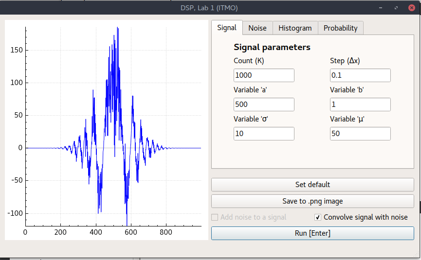
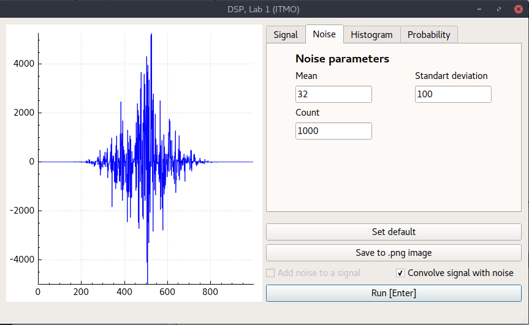
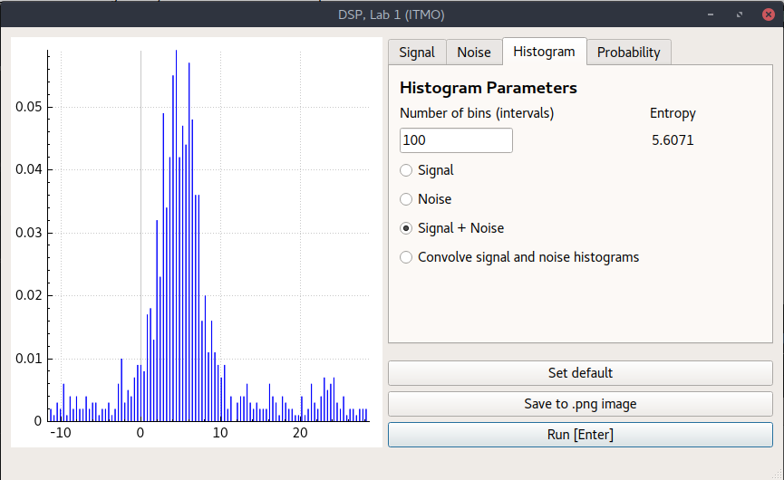
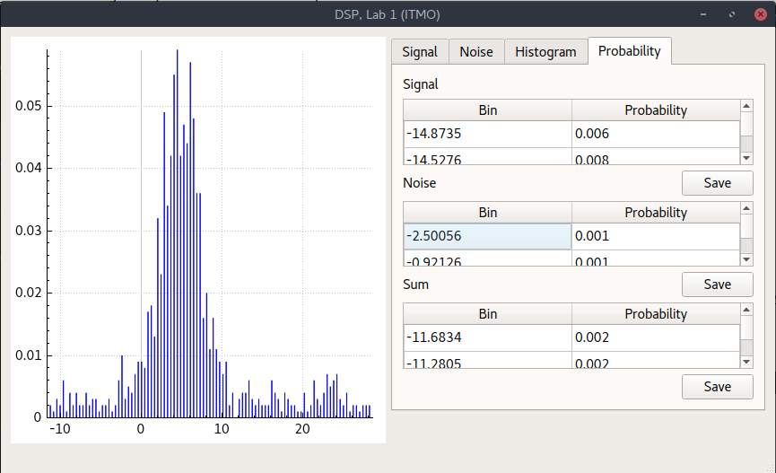

## DSP1 - Digital Signal Processing tool

DSP1 is a course project for the Information Theory course at the ITMO University. It allows user to study signals (that are defined by the formula below), their interactions with gaussian noise and the resulted probabilities of such interactions.

Formula used to produce signal output:

## Screenshots

## Third-party Components

The project is developed using [Qt](https://www.qt.io/) (Qt Creator + Qt Designer). Plotting is done using [QCustomPlot](http://www.qcustomplot.com/).