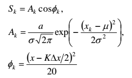
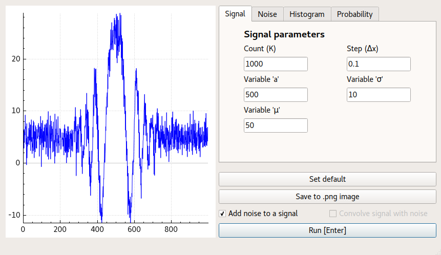
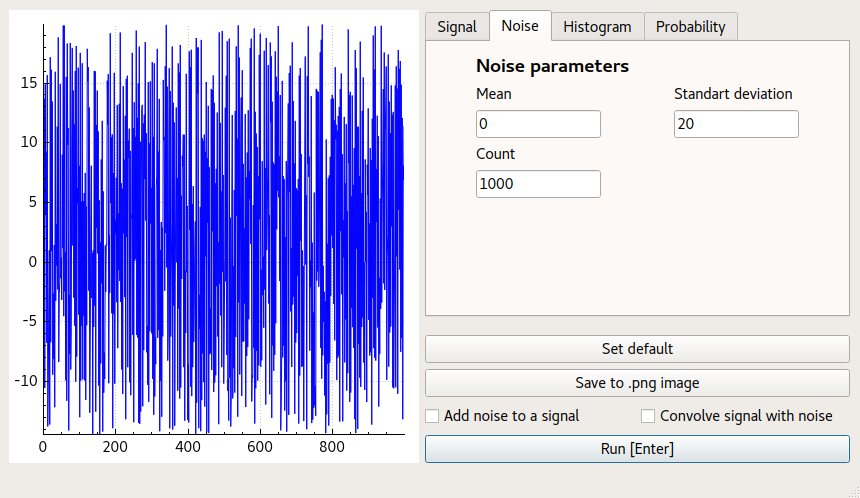
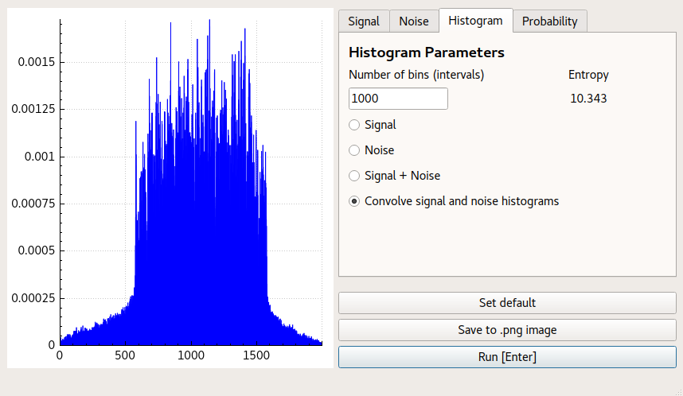
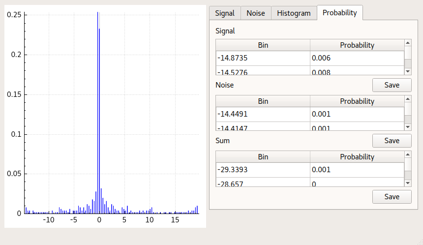

##   DSP1 - Digital Signal Processing tool 

DSP1 is a project for the Information Theory course at the ITMO University. It allows users to study signals (that are defined by the formula below), their interactions with gaussian noise and the resulted probabilities of such interactions.

Formula used to produce signal output:

## Screenshots

Noise is automatically cropped to fit within signal boundaries:

You can export probabilities to a .txt file for later analysis:

## Third-party Components

The project is developed using [Qt](https://www.qt.io/) (Qt Creator + Qt Designer). Plotting is done using [QCustomPlot](http://www.qcustomplot.com/).
